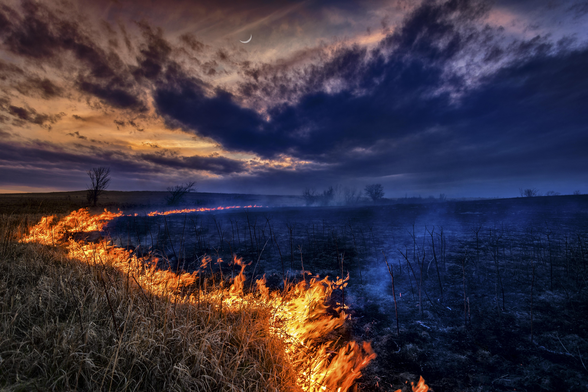
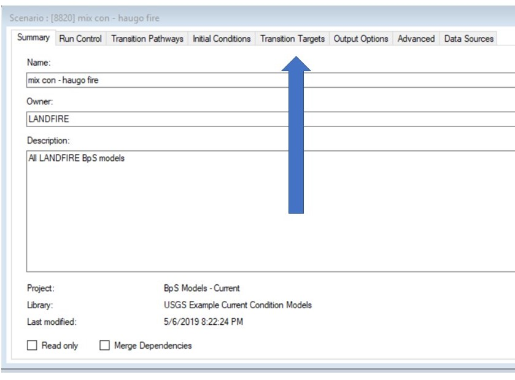
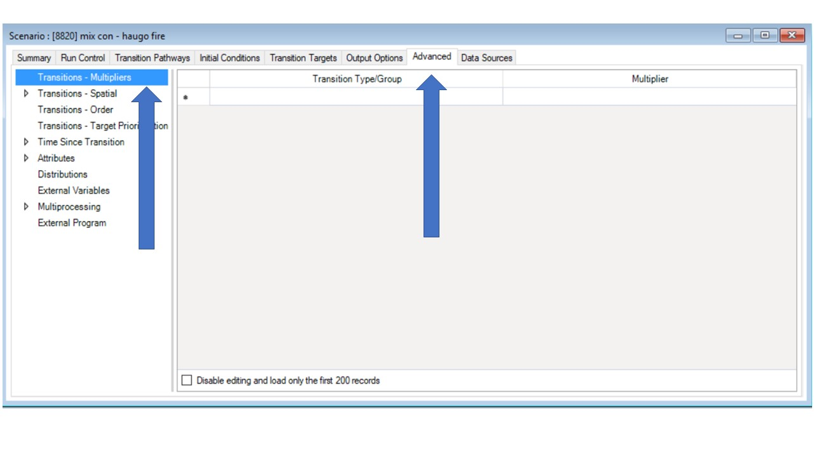
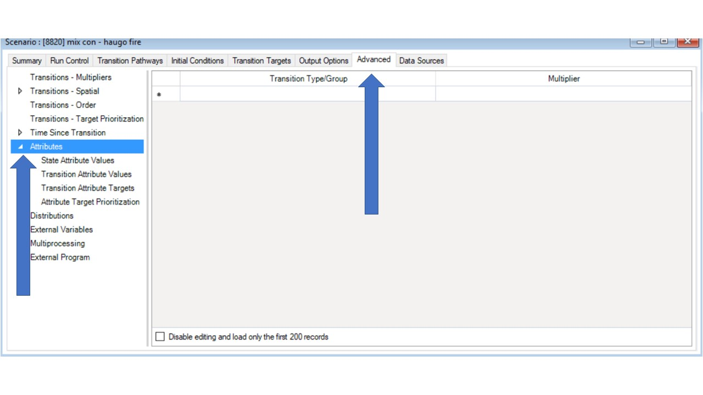
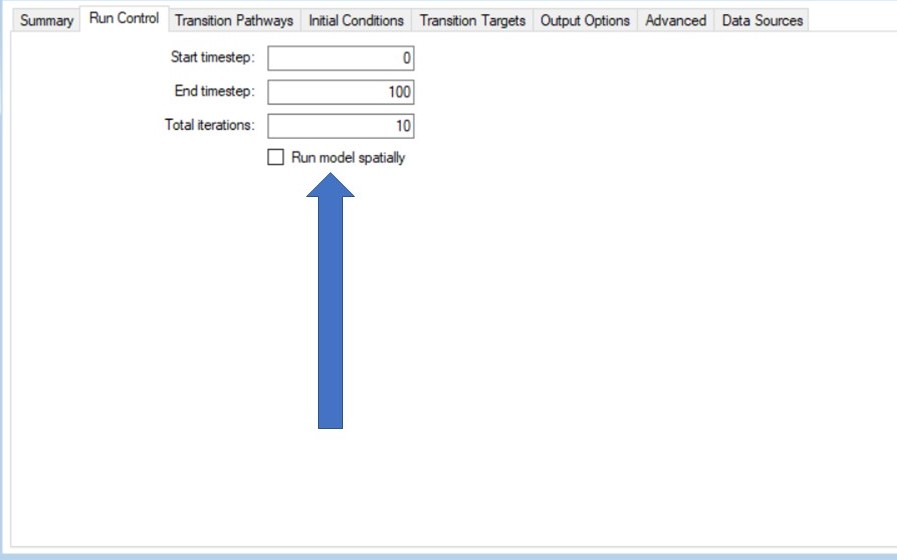
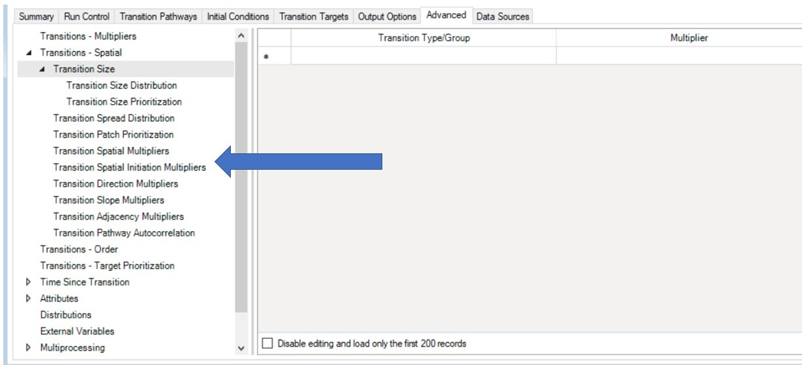

--- 
title: "Advanced Models"
author: 
date: 
output:
  html_document:
    fig_caption: yes
    toc: yes
    toc_depth: 4
    toc_float: yes

---
### This page
+ describe the advanced modeling options available in [ST-Sim](https://syncrosim.com/packages/){target='blank'}
+ explore ways to manipulate transition targets, multipliers, and state and transition attributes 
+ investigate the + and - of using spatial models

We will skim the surface of the possibilities to begin working in the [ST-Sim](https://syncrosim.com/packages/){target='blank'} platform. (Further) advanced modeling options can be viewed at the [Apex website](http://www.apexrms.com/){target='blank'} and documentation specific to ST-Sim can be found [here](http://docs.stsim.net/){target='blank'}. 

Visit the websites above to ensure you are seeing the latest version of the software. We encourage you to explore other advanced modeling options once you are familiar with the platform, but to not jump too quickly into advanced modeling options or complex models. This can cause confusion and slow progress.

**Ecosystems management is complex**. As you model you will most likely ask “*what if I could (fill in the blank) in the model*?"
(Caption to be inserted: Photo: © TNC. Controlled burn in Shawnee County, Kansas)
<br>
```{r, echo=FALSE, out.width='65%', out.extra='style="float:right; padding:10px"'} 


```
<br>
Here we demonstrate how to address potential scenarios that you may encounter in your modeling process:

* **Implement limits:** 
  + Ex: you may ask “_what would happen if we applied 1,000, 2,000 or 3,000 ha of controlled burning per year?_” Syncrosim can help answer that question.
* **Add variability** to annual disturbance probabilities: 
  + Ex: an ecosystem may experience an insect that has relatively predictable population cycles, with maximum population size every 7 years. You can incorporate this in SyncroSim.
* **Apply and track attributes:**
  + Ex: you may know that a “value” of interest (i.e. some beetle species) occurs exclusively within a state class. You can track these "values" in SyncroSim.
  

### Transition Targets

```{r, echo=FALSE, out.width='65%', out.extra='style="float:right; padding:10px"'} 


```

The **transition targets property** allows the modeler to define targets/limits for the area to transition over time across the landscape for specific types of transitions. Targets can be established as operational constraints based on area, or when costs are added on available budgets. The target can be specified by iteration, BpS, and timestep.

For example, you can **limit the amount of any probabilistic transition/disturbance to a specific number of acres in each timestep and iteration** for a BpS based on the budget you expect to be available, or on the operational constraint created by your organization’s capacity or regulatory issues. If you expect your budget or capacity to increase over time, you can increase the target over the timesteps. This option is available for all disturbances/probabilistic transitions.

Note that you can also set transition targets using a **probability distribution** (such as Normal, Uniform or Beta) if you believe the transition target constraint will vary over time according to distribution (rather than a specific amount). Once selected, you can specify the standard deviation, minimum and maximum values for the distribution, and how often to draw a new value from the distribution.

### Transition Multipliers

It is useful to be able to vary transition probabilities over time not just operational limits (see Transition Targets). **Transition multipliers** allow the user to modify how often a probabilistic transition/disturbance/change will be imposed on a pixel across timesteps or iterations. 


```{r, echo=FALSE, out.width='65%', out.extra='style="float:right; padding:10px"'} 


```

For example, under different climate change scenarios, transition probabilities will vary over time (i.e. fire may increase, succession/growth may speed up or slow down, strata may change locations on the landscape). The **transition multiplier values property** specifies multipliers to be applied to transition probabilities over the course of the simulation (i.e. increase the amount of thinning by 50% for the first 10 timesteps, and then increase by 100% for the remaining timesteps). The user can also use an **expected distribution of multipliers** they create from past events or recent information, or they can select the Beta or Normal statistical distributions packaged with the software. Using statistical distributions may require additional information such as minimum, maximum and standard deviation. 
<br>
<br>
Temporal Variability in Transitions
<br>

<center>
<iframe width="560" height="315" src="https://www.youtube.com/embed/TV4p4NspIME" frameborder="0" allow="accelerometer; autoplay; encrypted-media; gyroscope; picture-in-picture" allowfullscreen></iframe>
</center>
<br>

#### Statistical variability
A second application of the **transition multiplier** is when the modeler wishes to incorporate **statistical variability** into the model parameters over the timesteps and iterations because the actual value is unknown or varies across timesteps. 

For example, the probability of fire can vary each year. We can use **transition multipliers** to sample fire probabilities from a fire history we provide, or from a statistical distribution (instead of using a single probability over time or varying the probability by specific amounts). 
<br>

#### Transition multipliers & BpS

These videos describe how **transition multipliers** have been used with **LANDFIRE BpS models**. 
<center>
<br>

<iframe width="560" height="315" src="https://www.youtube.com/embed/86AC9e8H9vg" frameborder="0" allow="accelerometer; autoplay; encrypted-media; gyroscope; picture-in-picture" allowfullscreen></iframe>
<br>
<br>


<iframe width="560" height="315" src="https://www.youtube.com/embed/d855SupanQU?start=3" frameborder="0" allow="accelerometer; autoplay; encrypted-media; gyroscope; picture-in-picture" allowfullscreen></iframe>
</center>
<br>

### State and Transition Attributes

Suppose that you wish to **estimate values that are associated with various model states and/or model transitions**. Attributes can be used to roll up simulation results according to areas aggregated by either **state classes or transitions**. 


```{r, echo=FALSE, out.width='65%', out.extra='style="float:right; padding:10px"'} 


```

For example, how much smoke would be produced in a surface fire in a specific seral state (add an attribute reflecting average smoke production to surface fire transition)? 

What is the total habitat score for a particular species under each simulated scenario (add a habitat value score attribute to each seral state)? These values can then be summarized over the simulations to provide additional results that can be compared across scenarios. Do I produce more or less smoke in this scenario? Do I increase or decrease the habitat score in this scenario?

>Transition Targets, Transition Multipliers and Attributes can all be combined. 

Here's one application example from [Apex RMS](http://www.apexrms.com/){target='blank'}
<center>
<br>

<iframe width="560" height="315" src="https://www.youtube.com/embed/b3MQfyYE6ZQ" frameborder="0" allow="accelerometer; autoplay; encrypted-media; gyroscope; picture-in-picture" allowfullscreen></iframe>
</center>
<br>

We encourage you to progress slowly and use advanced modeling options step-by-step. Doing so will allow you to understand your model, explain the results, and troubleshoot problems. These things become more difficult as the model increases in complexity.
<br>
<br>

### Spatial Models

We have demonstrated how to modify and apply STSMs **aspatially**. However, ST-Sim does allow the user to run these models using **spatial functionality** _if_ the required data sets and information are available. 
```{r, echo=FALSE, out.width='65%', out.extra='style="float:right; padding:10px"'} 


```
A map of initial conditions can be specified as input to the STSM which can then produce a post-simulation output map. In addition, some “contagion” functionality is available that allows for disturbances to “spread” across the simulated from a starting point (fire, insects/disease, etc.). 

```{r, echo=FALSE, out.width='65%', out.extra='style="float:right; padding:10px"'} 


```

#### Limitations
Running these models spatially can provide significant value, however, there are two cautions:

1. significant input information is required to make this spatial option useful
2. we recommend completing a thorough review of your model **aspatially** to ensure you are satisfied **before moving to the spatial option**
<br>
<br>


### Spatial Modeling Using St-Sim

Incorporating spatial functionality increases the complexity of the model as well as the modeling options. Additional training or support from Apex RMS may be warranted as you move toward spatial implementation.
<br>
<br>
Spatial Modeling Using ST-Sim
<br>

<center>
<iframe width="560" height="315" src="https://www.youtube.com/embed/k0UeCCIGuf4" frameborder="0" allow="accelerometer; autoplay; encrypted-media; gyroscope; picture-in-picture" allowfullscreen></iframe>
</center>
