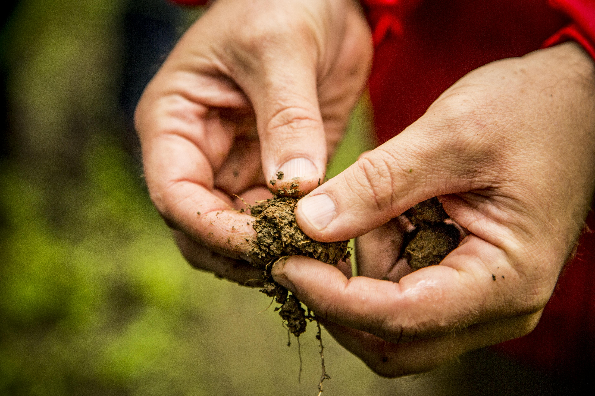

### This page:
+ context about climate change and ecosystem impacts
+ ways that BpS models can enhance understanding of ecosystems when accounting for climate change
+ examples of how to alter disturbances and states to mimic climate change in the BpS modeling framework 

## Climate Change and STSM Modeling

The goal of this section is to help you identify questions that the LANDFIRE BpS models (with their built-in simplifications, strengths, and constraints) are best suited to help you explore.

### Background 
Directional changes in climate factors, such as **increases in minimum or maximum temperatures, changes in precipitation patterns, and increases in evaporation and transpiration rates,** are influencing vegetation dynamics through many mechanisms operating at a range of scales, from genes to biomes. Observed changes, in addition to ecological theory, allow us to generate hypotheses on how these changes may play out. As noted in a [previous sections](/perspectives.html), all models are a simplification of reality, and there are many different aspects of climate change that you might be interested in exploring with a model.

Climate drivers like **temperature** and **moisture availability** play critical roles in shaping the life history of plants and associated species in terrestrial ecosystems. As **anthropogenic factors have acted to accelerate the rate of climate change**, we are seeing a wide array of responses in plants, and other species that strongly influence vegetation dynamics. 

> The most frequently documented responses to climate change include changes in phenology (the timing of seasonal events, such as budburst), spatial shifts in range boundaries, and shifts in density patterns within a species’ range due to changes in recruitment or mortality as site conditions change. 

Each species has evolved to develop a set of traits that reflect climate, abiotic factors, and competition for resources and other species interactions. The suite of species that make up an ecosystem are likely to respond differently to climate change, leading to **shifts in plant community composition**. 

<center>
```{r, echo=FALSE, out.width= "45%"} 
knitr::include_graphics("images/fern.jpg")

```
</center>
<br>
<center>
Photo: © Marci Eggers, TNC. 
Close-up of of fern about to spring open in the Atlantic Forest rainforest, Guaraquecaba, Brazil.
</center>
<br>
<style>
div.blue { background-color:#cde6c8; border-radius: 5px; padding: 20px;}
</style>
<div class = "blue">
Notably for applications with BpS models, changes in climate are **influencing disturbance regimes**. For example:

1. Drought tends to lengthen fire seasons and increase fire intensity

2. Higher temperatures (or temperature gradients) increase the intensity and dominant direction of wind patterns and probability of severe storms (i.e. hurricanes)

3. Increasing temperatures strongly affect poikilothermic (cold-blooded) species associated with vegetation, contributing to increased growth rates and higher numbers of generations per growing season for leaf/sap consuming insects

</div>
<br>

## Climate change and BpS models

As [previously described](/.modifyModel.html), LANDFIRE BpS models are comprised of a set of **states** and **transitions**. Each state is a recognizable seral stage or “condition” of a particular vegetation type, and these states are linked by **deterministic transitions** (usually representing growth towards an older, taller age class), and stochastic transitions representing disturbances such as fire (with an associated probability land intensity), windthrow, insect outbreak, etc. These transitions describe how **one vegetation state is changed to a different state**. In the montane sagebrush steppe ecosystem example below, the dominant species is "X" and the growth and response to disturbances are reflected in that species’ biology. Common to this ecosystem would be disturbances such as wildfire and invasive species (i.e. cheatgrass invasion). 

INSERT KIM'S MODIFIED SLIDE EXAMPLE HERE:

In other vegetation classes with higher tree species diversity, such as mixed hardwood forests of the southern Appalachians, **transitions represent an average across multiple species** that are likely responding to climate drivers in different ways. 

## Changes in disturbance regime 

The “sweet spot” for LANDFIRE BpS models in a climate change context is exploring **how climate change can influence disturbance regimes,** and as a result **influence the relative proportion of each ecosystem state over time**. These tools allow users to consider time periods much longer than human experience (i.e., hundreds or thousands of years) and [illuminate](.perspectives.html) how events with a range of different frequencies can interact to shape the distribution of vegetation classes on the landscape. While climate change impacts are complex, this does *not* mean you should try to capture the full range of complexity in your model.  

For example, the interaction between **drought**, **insect outbreaks**, and **fire** is an example of a multi-factor, climate-related driver of change in forested ecosystem, especially notable now in the western U.S. 

>For example you *could* take an existing BpS model and add a drought factor, modify the current fire disturbances, and add an insect pest factor, if these three drivers tend to operate together. However we suggest at least starting your modeling work by treating this complex of drivers as **one disturbance**, potentially starting with the one for which you have the **best information** on. 


**Placeholder: insert slide with insect invasion added, and possible more perturbations introduced OR reflective of the fire regime comment**

### Altering disturbances
```{r, echo=FALSE, out.width='30%', out.extra='style="float:right; padding:10px"'} 
knitr::include_graphics("images/disturbance.jpg")

```

* Adding or removing a type of disturbance
* Modifying the intensity, or distribution across intensity levels (e.g., low, med, high)
* Changing the rate (probability) – with the caveat that the models are [aspatial](./AdvancedModeling.html)
* Incorporating a rate multiplier, which allows the probability of a disturbance to change over time
<br>
<br>

### Altering states
```{r, echo=FALSE, out.width='75%', out.extra='style="float:right; padding:10px"'} 
knitr::include_graphics("images/states.jpg")

```

* Adding or removing vegetation classes (i.e adding a new invasive plant species that is favored by some aspect of climate change)
* Slowing down or speeding up succession to represent a change in growth rates, or slower recovery
* Transitioning a vegetation class to a new BpS
<br>

## BpS and climate change examples

#### More intense fires
Increases in the intensity of fires is a trend that has been observed in forests with high vegetation density, often in combination with drought. To represent this process, you would **increase the probablility of high intensity fires** in your model – or potentially add this type of disturbance if it was not already in the model.

<center>
```{r, echo=FALSE, out.width= "70%"} 
knitr::include_graphics("images/califorina.jpg")

```
</center>
<br>
<center>
Photo: © Ben Jiang, TNC. One of the 2018 California wildfires.
</center>
<br>

#### Longer fire seasons

* [Cattau et al. 2020](https://doi.org/10.1111/geb.13058){target='blank'} examine the extension of the **duration of the fire season** due to climate change both by natural ignition sources and human-caused fires. This would involve **increasing the fire return interval** within this modeling platform. 

<center>
```{r, echo=FALSE, out.width= "70%"} 
knitr::include_graphics("images/nebraska.jpg")

```
</center>
<br>
<center>
Photo: © Chris Helzer, TNC. Niobrara River near the headquarters of the Nature Conservancy's Nebraska Niobrara Valley Preserve after the 2012 wildfire.
</center>
<br>

#### Larger fires
```{r, echo=FALSE, out.width='55%', out.extra='style="float:right; padding:10px"'} 


```
Similarly, increasing the spatial extent of fires – mechanistically, this also involves increasing the rate of fires, so it’s hard to separate the two mechanism of change using the LANDFIRE BpS model. 

Photo caption to be included: © Stavros Mitchelides, TNC Photo Contest 2019. Dense wildfire smoke in Banff National Park.

#### Insect outbreaks

Insect outbreaks that promote a state change in vegetation are not included in the “out of the box” BpS models. **Insect outbreaks can be added and varied in all of the ways described above for fire.** 

Impacts from warming temperatures include:

1. increase in the **overwinter survival** of insects
2. increase in the **number of generations** possible in a single season
3. increase in **insect growth rates**
  
Adding a separate insect outbreak component may be highly relevant, especially if there is evidence to support impacts that are independent of other drivers. In the case of drought-stressed trees contributing to high tree mortality, understanding variations in drought risk, for example associated with topography or soil water holding capacity, may allow you to partition out impacts by site conditions (see last bullet). 

#### Transitions in vegetation classes
```{r, echo=FALSE, out.width='55%', out.extra='style="float:right; padding:10px"'} 


```
Photo caption to be inserted: Photo: © Devan King/TNC

In some vegetation systems, managers have observed that increases in the intensity or extent of fires is leading to a failure of the ecological system to regenerate – reasons may include a loss of organic soil horizons in the intense fire, or a lack of seed sources close to the newly burned area. 

This observation could be modeled by **adding a new vegetation class** (perhaps a grass or shrub class), or by **increasing the duration of transition from the post-fire seral stage back to forest** (to represent slower regrowth of trees, perhaps aided by active seed additions).  

While BpS models are [aspatial](./advancedModeling.html), you can capture that variation by **developing separate iterations of the same model** if you have information on how vegetation dynamics might vary within an assessment area.
  + For example, topographic factors or soil moisture may strongly influence the sensitivity of a system to a disturbance, the rate of recovery after a disturbance, or the probability that a disturbance will shift a vegetation type to a new class.  

The influence of **native and non-native insect pests** is changing due to climate change, a pattern that can have major impacts on forest health when combined with a change in **tree health due to drought exposure**. Like fire, changes in the impact of insects can occur through changes in intensity, and/or duration of exposure.

## BpS models are not spatial models
The structure of the BpS models provides a clear indication of the ecological level at which they operate, and can be applied to address questions about climate change. While range shifts are some of the most studied aspects of climate change responses, **these models are not spatial**, and tend to “lump” all species within a vegetation class together within a series of states. 

If you are interested in exploring vegetation responses within what the BpS models consider a “state” – for example, exploring changes in species composition that might occur as a result of changes in tree competitive ability as growing seasons lengthen due to a warming climate – BpS models are likely not the best hammer for that nail! 

***

#### What's next?
+ understanding the [characteristics of the model](./perspectives.html) and taking a bird's eye view when considering BpS models

***


All this is unchanged 

Climate Change and STSM Modeling

The goal of this section is to help you identify questions that the LANDFIRE BpS models (with their built-in simplifications, strengths, and constraints) are best suited to help you explore.

Background 
Directional changes in climate factors, such as **increases in minimum or maximum temperatures, changes in precipitation patterns, and increases in evaporation and transpiration rates,** are influencing vegetation dynamics through many mechanisms operating at a range of scales, from genes to biomes. Observed changes, in addition to ecological theory, allow us to generate hypotheses on how these changes may play out. As noted in a [previous sections] (link to Modeling perspectives), all models are a simplification of reality, and there are many different aspects of climate change that you might be interested in exploring with a model.

Climate drivers like **temperature** and **moisture availability** play critical roles in shaping the life history of plants and associated species in terrestrial ecosystems. As anthropogenic factors have acted to accelerate the rate of climate change, we are seeing a wide array of responses in plants, and other species that strongly influence vegetation dynamics. 

> The most frequently documented responses to climate change include changes in phenology (the timing of seasonal events, such as budburst), spatial shifts in range boundaries, and shifts in density patterns within a species’ range due to changes in recruitment or mortality as site conditions change. 

Given that over evolutionary time, each species has developed a set of traits that reflect climate, abiotic factors, and competition for resources and other types of species interactions, we expect that the suite of species that make up an ecosystem will not all respond in the same way, leading to shifts in plant community composition. 

<center>
```{r, echo=FALSE, out.width= "45%"} 
knitr::include_graphics("images/fern.jpg")

```
</center>
<br>
Photo: © Marci Eggers, TNC. Close-up of of fern about to spring open in the Atlantic Forest rainforest, Guaraquecaba, Brazil.

<br>
<style>
div.blue { background-color:#cde6c8; border-radius: 5px; padding: 20px;}
</style>
<div class = "blue">
Notably for applications with BpS models, changes in climate are influencing disturbance regimes. For example:

1. Drought tends to lengthen fire seasons and increase fire intensity

2. Higher temperatures (or temperature gradients) increase the intensity and dominant direction of wind patterns and probability of severe storms (i.e. hurricanes)

3. Increasing temperatures strongly affect poikilothermic (cold-blooded) species associated with vegetation, contributing to increased growth rates and higher numbers of generations per growing season for leaf/sap consuming insects

</div>
<br>

Climate change and BpS models

As described here (link to a section on model structure), LANDFIRE BpS models are comprised of a set of **states** and **transitions**. Each state is a recognizable seral stage or “condition” of a particular vegetation type, and these states are linked by deterministic transitions (usually representing growth towards an older, taller age class), and stochastic transitions representing disturbances such as fire (with an associated probability land intensity), windthrow, insect outbreak, etc. These transitions describe how one vegetation state is changed to a different state. In the montane sagebrush steppe ecosystem example below, the dominant species is "X" and the growth and response to disturbances are reflected in that species’ biology. Common to this ecosystem would be disturbances such as wildfire and invasive species (i.e. cheatgrass). 


In other vegetation classes with higher tree species diversity, such as mixed hardwood forests of the southern Appalachians, transitions represent an average across multiple species that are likely responding to climate drivers in different ways. 

Changes in disturbance regime 

The “sweet spot” for LANDFIRE BpS models in a climate change context is exploring **how climate change can influence disturbance regimes,** and as a result influence the relative proportion of each ecosystem state over time. These tools allow users to consider time periods much longer than human experience (i.e., hundreds or thousands of years) and “illuminate” (link to Jim’s overview) how events with a range of different frequencies can interact to shape the distribution of vegetation classes on the landscape. However, remember that while the impacts of climate change on ecological systems are complex, this does not mean you should try to capture the full range of complexity in your model.  

For example, the interaction between **drought**, **insect outbreaks**, and **fire** is an example of a multi-factor, climate-related driver of change in forested ecosystem, especially notable now in the western U.S. 

>While you could take an existing BpS model and add a drought factor, modify the current fire disturbances, and add an insect pest factor, if in effect these three drivers tend to operate together, we suggest at least starting your modeling work by treating this complex of drivers as **one disturbance**, potentially starting with the one for which you have the best information on rates (this might be fire regime). 


**Placeholder: insert slide with insect invasion added, and possible more perturbations introduced OR reflective of the fire regime comment**

As you gain experience and insight, you can consider what additional things you might learn by trying to tease apart these interacting factors – for example by bringing in insect outbreaks as a separate factor, but with rates that recognize the role of drought conditions in both disturbance pathways (fire and insects). In the bulleted sections below, we link climate-related changes to how you would model them in the BpS-in-SyncroSim platform, moving from the basics to more specific hypotheses of change. 

Altering disturbances

* Adding or removing a type of disturbance (see below)
* Modifying the intensity, or distribution across intensity levels (e.g., low, med, high)
* Changing the rate (probability) – with the caveat that the models are aspatial, so if spread of the disturbance across the landscape is a process you want to understand, you will likely want to complement your work with additional tools
* Incorporating a rate multiplier, which allows the probability of a disturbance to change over time


```{r, echo=FALSE, out.width= "35%"} 
knitr::include_graphics("images/disturbance.jpg")

```

Altering states

* Adding or removing vegetation classes. This can include adding a new invasive plant species that is favored by some aspect of climate change.
* Slowing down or speeding up succession to represent a change in growth rates, or slower recovery (see above).
* Transitioning a vegetation class to a new BpS (? Not sure you want this here??)

```{r, echo=FALSE, out.width= "100%"} 
knitr::include_graphics("images/states.jpg")

```

BpS and climate change examples

More intense fires
Increases in the intensity of fires, a trend that has been observed in forests with high vegetation density, often in combination with drought.  To represent this process, you would **increase the probablility of high intensity fires** in your model – or potentially add this type of disturbance if it was not already in the model.

<center>
```{r, echo=FALSE, out.width= "65%"} 
knitr::include_graphics("images/califorina.jpg")

```
</center>
<br>
Photo: © Ben Jiang, TNC. One of the 2018 California wildfires.
<br>
<br>

Longer fire seasons

* [Cattau et al. 2020](https://doi.org/10.1111/geb.13058){target='blank'} examine the extension of the duration of the fire season due to climate change both by natural ignition sources and human-caused fires. Looking at this question would involve **increasing the fire return interval** within this modeling platform. 

<center>
```{r, echo=FALSE, out.width= "65%"} 
knitr::include_graphics("images/nebraska.jpg")

```
</center>
<br>
Photo: © Chris Helzer, TNC. Niobrara River near the headquarters of the Nature Conservancy's Nebraska Niobrara Valley Preserve after the 2012 wildfire.
<br>
<br>

Larger fires

* Similarly, increasing the spatial extent of fires – mechanistically, this also involves increasing the rate of fires, so it’s hard to separate the two mechanism of change using the LANDFIRE BpS model. 

Insect outbreaks

* Insect outbreaks that promote a state change in vegetation are not included in the “out of the box” BpS models. **Insect outbreaks can be added, and then varied, in all of the ways described above for fire.** 

  Warming temperatures:
  
  * increase the overwinter survival of insects
  * increase the number of generations possible in a single season
  * increase insect growth rates
  
  Adding a separate insect outbreak component may be highly relevant, especially if there is evidence to support impacts that are independent of other drivers. In the case of drought-stressed trees contributing to high tree mortality, understanding variations in drought risk, for example associated with topography or soil water holding capacity, may allow you to partition out impacts by site conditions (see last bullet). 

Transitions in vegetation classes

* In some vegetation systems, managers have observed that increases in the intensity or extent of fires is leading to a failure of the ecological system to regenerate – reasons may include a loss of organic soil horizons in the intense fire, or a lack of seed sources close to the newly burned area. This observation could be modeled by **adding a new vegetation class** (perhaps a grass or shrub class, if the intent is to explore how this shift might drive an ecological transformation), or by **increasing the duration of transition from the post-fire seral stage back to forest**, to represent slower regrowth of trees, perhaps aided by active seed additions.  
Representing variations in climate change exposure, or adaptive capacity within an assessment region

* While BpS models are aspatial (see below), you can capture that variation by **developing separate iterations of the same model if you have information on how vegetation dynamics might vary within an assessment area.** For example, topographic factors or soil moisture may strongly influence the sensitivity of a system to a disturbance, the rate of recovery after a disturbance, or the probability that a disturbance will shift a vegetation type to a new class.  

*(delete this paragraph?)* The influence of native and non-native insect pests is changing due to climate change, a pattern that can have major impacts on forest health when combined with a change in tree health due to drought exposure.  Like fire, changes in the impact of insects can occur through changes in intensity, and/or duration of exposure (i.e., warmer temperatures are increasing overwinter 

BpS models are not spatial models
The structure of the BpS models provides a clear indication of the ecological level at which they operate, and can be applied to address questions about climate change. While range shifts are some of the most studied aspects of climate change responses, these models are not spatial, and tend to “lump” all species within a vegetation class together within a series of states. **This is because it would be impossible to use this modeling platform to model the mechanistic relationships between all species within all types of ecosystems...** If you are interested in exploring vegetation responses within what the BpS models consider a “state” – for example, exploring changes in species composition that might occur as a result of changes in tree competitive ability as growing seasons lengthen due to a warming climate – BpS models are likely not the best hammer for that nail! 

***

What's next?
+ understanding the [characteristics of the model](./perspectives.html) and taking a bird's eye view when considering BpS models
