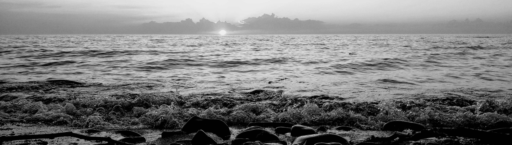

```{r setup, include=FALSE}
knitr::opts_chunk$set(cache = TRUE)
```
----
<br>

## What this website is about
How does vegetation vary on the landscape? How do we figure it out? LANDFIRE Biophysical Settings models and descriptions provide a *framework* for exploring these questions, and for testing potential management strategies before trying them on the ground.  
<br>

### What will you find on this website?
A process and resources that will facilitate use of LANDFIRE BpS models and the free sofware SyncroSim on the following pages:

**State and Transition Models**
An introduction to state and transition models. This is where you begin if you are not already familiar with State and Transition Models (STSM).

**LANDFIRE STSM**
What you need to know about LANDFIRE STSM. What are they and what do they represent?

**Reviewing a LANDFIRE STSM**
Obtain a specific LANDFIRE STSM and understand its components.

**Modifying a Model for Your Use**
How do you setup, modify and run a model to answer your questions?

**Some Advanced Modeling Options**
We describe a few examples of additional modeling functionality that might find useful.

**Contacts and Additional resources**
Find resources and contacts that you may find useful.

**Example Modified Models**
Examine a suite of LANDFIRE STSM that have been modified to represent current conditions

**Perspectives**
Let’s explore modeling issues and consider appropriate application.


<br>


```{r, echo=FALSE, fig.height= .8}

```


