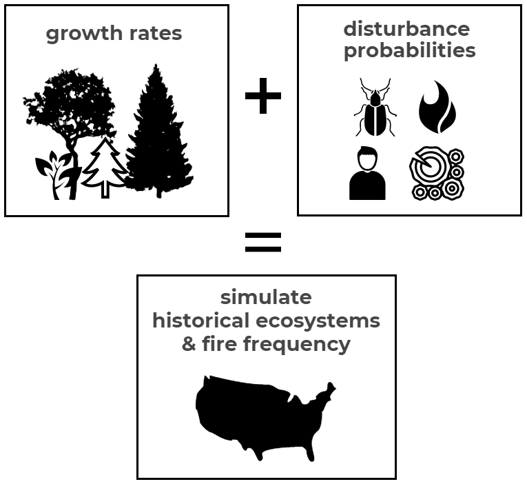

### What will you find on this website?

Brief tutorials on how to use BpS models and the free modeling software, SyncroSim. When integrated into state and transition models, this framework can improve and enhance landscape predictions and research projections.  

LANDFIRE’s state-and-transition simulation models use inputs such as the rates of growth and the probabilities of different disturbances to simulate the dynamics of ecosystem over time. LANDFIRE uses the models to estimate the historical composition and structure of ecosystems and the frequency and severity of wildfire prior to European-American settlement, but they can be used for a variety of other purposes.

What is a biophysical model?  
Bps models use quantative simulations of biological and physical inputs to make predictions about the future of natural systems. LANDFIRE's BpS models were created using state and transition models to summarize ecosystem processes such as **growth rates** and **disturbance probabilities** while simulating their dynamic interplay over time. 

### Why model?  
#### Modeling biophysical models provide a framework for:  

1. simulating disturbances and testing potential management strategies  
2. modeling vegetation characteristics on the landscape  
3. making predictions of future landscape conditions
 

Get started with integrating biophysical settings into your current work

 

<iframe width="760" height="415" src="https://www.youtube.com/embed/8GLboPfOIJ4" frameborder="0" allow="accelerometer; autoplay; encrypted-media; gyroscope; picture-in-picture" allowfullscreen></iframe>

