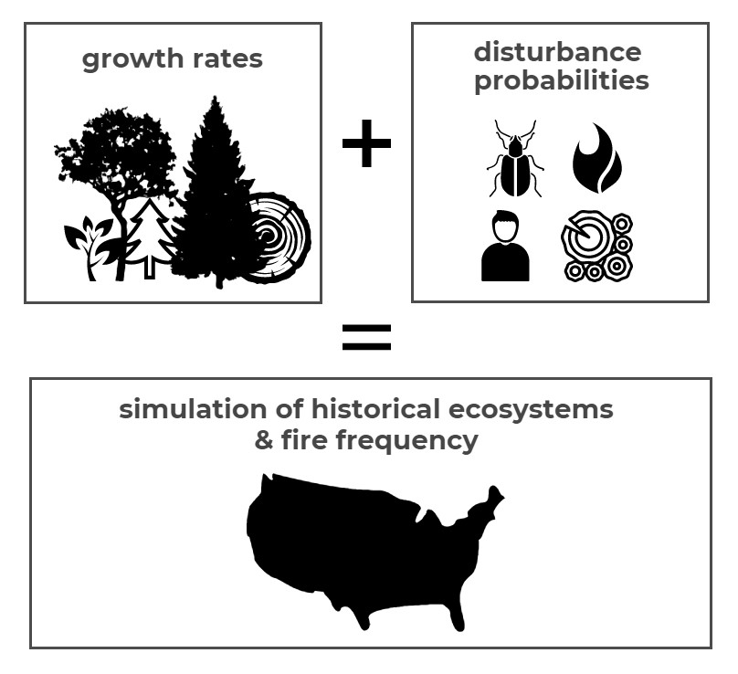

### This page:
+ introduction to state-and-transition simulation models (STSM)
+ explanation of LANDFIRE biophysical settings (BpS) models
+ example of an STSM  
+ getting started with [SyncroSim](https://syncrosim.com/)

### State-and-transition models

A **state-and-transition model** (STM) conceptualizes vegetation in terms of discrete states and the transitions or pathways between them [(Westoby 1989)](http://rangelandarchive.ucdavis.edu/files/187350.pdf). States are often used to represent discrete development (seral) stages, and transitions may represent disturbances such as hurricanes, fire, or grazing, but can also represent management actions such as thinning, livestock management, or herbicide application. Conceptual state-and-transition models, called [Environmental Site Descriptions](https://www.nrcs.usda.gov/wps/portal/nrcs/main/national/technical/ecoscience/desc/) (ESDs), have been developed through an inter-agency partnership and widely used to monitor, evaluate, and manage rangelands.

### State-and-transition _simulation_ model

When a STM is built in a software environment with rates of growth between states and probabilities for each transition, it is known as a **state-and-transition simulation model** (STSM; [Daniel et al. 2016](https://besjournals.onlinelibrary.wiley.com/doi/pdf/10.1111/2041-210X.12597)). A STSM can be used to **simulate the dynamics of a system over time and space.** STSMs have been widely applied in natural resource management to estimate historical conditions ([Donato et al. 2020](https://esajournals.onlinelibrary.wiley.com/doi/epdf/10.1002/eap.2013), [Blankenship et al. 2012](https://www.fs.fed.us/pnw/pubs/pnw_gtr869/pnw_gtr869_004.pdf)), simulate the spread of invasive species ([Jarnevich et al. 2019](https://esajournals.onlinelibrary.wiley.com/doi/full/10.1002/ecs2.2730)), test various management scenarios ([Low et al. 2010](https://www.conservationgateway.org/Documents/Enhanced%20conservation%20action%20planning_assessing%20landscape%20condition.pdf), [Costanza et al. 2015a](https://www.aimspress.com/article/10.3934/environsci.2015.2.180)), and forecast future landscape conditions under different climates ([Provencher et al. 2016](https://www.springer.com/gp/book/9783319249285), [Swearingen et al. 2015](https://www.aimspress.com/fileOther/PDF/environmental/201503737.pdf), [Costanza et al. 2015b](https://www.sciencedirect.com/science/article/pii/S0301479714006112)). 

<br>

<center>
```{r echo=FALSE, message=FALSE, warning=FALSE}

htmltools::tags$iframe(title = "My embedded document", src = "kbslick5.html", frameborder = "0", width = "100%", height="450")
```

</center>

### LANDFIRE BpS models: a complete set for the U.S.

<style>
div.blue { background-color:#cde6c8; border-radius: 5px; padding: 20px;}
</style>
<div class = "blue">

The **[LANDFIRE](www.landfire.gov)** Program, in collaboration with experts around the country, created a set of over 900 STSMs for ecosystems in the United States. Each LANDFIRE STSM represents a **Biophysical Setting** – a vegetation concept that describes the vegetation community likely to have been dominant on the landscape prior to European American settlement given an approximation of historical disturbance regimes and the current biophysical environment. 

Simply put, **[LANDFIRE BpS models](https://www.landfire.gov/bps-models.php)** are **reference condition models** that define natural vegetation communities and their historical disturbance regimes. Later in this website you will learn more about these models and how to **modify** them to represent current landscapes and simulate possible future conditions.
</div>
<br>

### SyncroSim software

LANDFIRE currently uses the [SyncroSim software](https://syncrosim.com/) and its [ST-Sim package](https://syncrosim.com/packages/) as the modeling platform to develop and deliver its STSMs. SyncroSim is available for free and is the latest in a series of related STSM software packages including Path and the [Vegetation Dynamics Development Tool](https://essa.com/explore-essa/tools/vddt/) (VDDT). SyncroSim is a flexible modeling platform that can be used to simulate virtually any ecosystem and provides user control over much of its functionality. The model is stochastic and can be run either spatially or non-spatially. 


#### Getting started in SyncroSim


The native environment of LANDFIRE BpS models is SyncroSim. If you want to explore or use the BpS models, you will want to familiarize yourself with and download the software:

1. Read the [overview of SyncroSim](http://docs.syncrosim.com/getting_started/overview.html)
2. Download and install [SyncroSim](https://syncrosim.com/) and the [ST-Sim](https://syncrosim.com/packages/) package
3. Complete the [Quickstart: An Introduction to SyncroSim](http://docs.syncrosim.com/getting_started/quickstart.html)

<br>

### Review
State-and-transition simulation models use inputs such as the **rates of growth** and the **probabilities of disturbance** to simulate the dynamics of ecosystems. Using SyncroSim software users can build, modify, and run STSMs to explore landscape change over time and space.

<center>
```{r, echo=FALSE, out.width= "55%"} 


```
</center>

**See Contacts and Resources for full reference list**

#### What's next?
+ dig in to the nuances of [BpS models](./BpSmodels.html)
+ [locate and download your models](./GetModels.html) of interest from Map Zone
+ tinker around with [modifying your model](./modifyModel.html) by introducing disturbances to state classes and entire models  